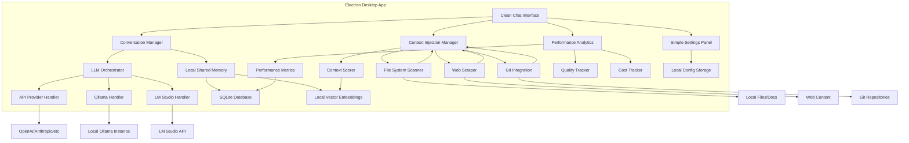
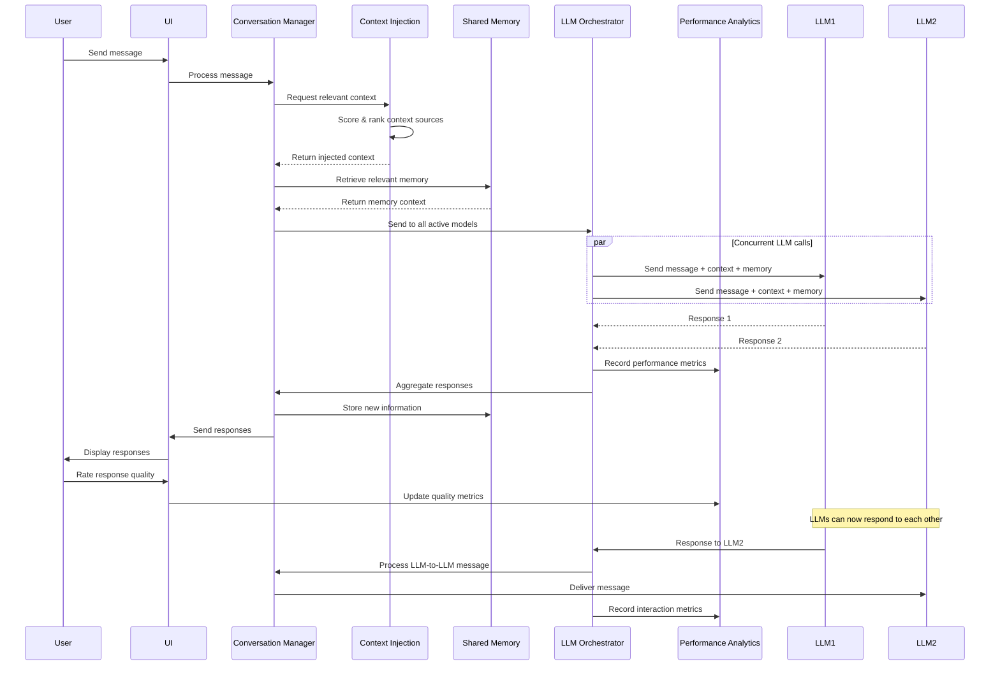

# Multi-LLM Chat Interface Design Document

## Overview

The Multi-LLM Chat Interface is a standalone desktop application that users can simply click and run. It provides a clean, intuitive interface for real-time conversations between users and multiple Large Language Models simultaneously. The system supports various LLM providers (API-based, Ollama, LM Studio) and implements a shared memory system that allows models to communicate with each other and maintain persistent context across sessions.

## Architecture

### High-Level Architecture



### Technology Stack

- **Desktop Framework**: Electron with React/TypeScript for cross-platform compatibility
- **UI Framework**: React with a clean, minimal design system (Tailwind CSS or similar)
- **Local Storage**: 
  - SQLite for conversation history and configuration
  - Local vector embeddings (using transformers.js or similar) for semantic memory
- **LLM Integration**: Native HTTP clients for each provider
- **Packaging**: Electron Builder for creating distributable executables (.exe, .dmg, .AppImage)

## Components and Interfaces

### 1. Clean Chat Interface Component

**Purpose**: Simple, intuitive desktop UI for user interaction and conversation display

**Key Features**:
- Minimalist message input with clear send button
- Clean message bubbles with distinct model colors/avatars
- Simple sidebar for active models (easy add/remove buttons)
- Streamlined conversation history with smooth scrolling
- One-click model management (no complex menus)

**UI Design Principles**:
- Clean, uncluttered layout with plenty of whitespace
- Consistent color scheme and typography
- Intuitive icons and buttons
- Responsive design that works on different screen sizes
- Dark/light theme support

**Interface**:
```typescript
interface ChatMessage {
  id: string;
  content: string;
  sender: 'user' | string; // 'user' or model identifier
  timestamp: Date;
  replyTo?: string; // For threading LLM-to-LLM conversations
  metadata?: {
    model: string;
    provider: string;
    processingTime?: number;
  };
}

interface ConversationState {
  id: string;
  participants: ModelParticipant[];
  messages: ChatMessage[];
  sharedMemory: SharedMemoryContext;
}
```

### 2. LLM Orchestrator

**Purpose**: Manages communication with multiple LLM providers and coordinates responses

**Key Features**:
- Provider abstraction layer
- Concurrent request handling
- Response aggregation and ordering
- Error handling and retry logic

**Interface**:
```typescript
interface LLMProvider {
  id: string;
  name: string;
  type: 'api' | 'ollama' | 'lmstudio';
  config: ProviderConfig;
  isActive: boolean;
}

interface ModelParticipant {
  id: string;
  provider: LLMProvider;
  modelName: string;
  displayName: string;
  color: string;
  avatar?: string;
  isActive: boolean;
}

interface LLMResponse {
  modelId: string;
  content: string;
  metadata: {
    processingTime: number;
    tokenCount?: number;
    error?: string;
  };
}
```

### 3. Shared Memory System

**Purpose**: Maintains persistent context and knowledge base accessible to all LLMs

**Key Features**:
- Semantic search for relevant context retrieval
- Automatic summarization of long conversations
- Knowledge extraction and storage
- Memory relevance scoring

**Interface**:
```typescript
interface SharedMemoryContext {
  conversationId: string;
  facts: MemoryFact[];
  summaries: ConversationSummary[];
  relationships: EntityRelationship[];
}

interface MemoryFact {
  id: string;
  content: string;
  source: string; // model or user who contributed
  timestamp: Date;
  relevanceScore: number;
  tags: string[];
}

interface ConversationSummary {
  id: string;
  timeRange: { start: Date; end: Date };
  summary: string;
  keyPoints: string[];
  participants: string[];
}
```

### 4. Provider Handlers

**Purpose**: Implement provider-specific communication protocols

#### API Provider Handler
- Supports OpenAI, Anthropic, Cohere, etc.
- Handles authentication and rate limiting
- Implements retry logic with exponential backoff

#### Ollama Handler
- Connects to local Ollama instance
- Manages model loading/unloading
- Handles streaming responses

#### LM Studio Handler
- Integrates with LM Studio's OpenAI-compatible API
- Discovers available models
- Manages connection health

### 5. Context Injection Manager

**Purpose**: Intelligently injects relevant contextual information from various sources to enhance LLM responses

**Key Features**:
- Multi-source context aggregation (files, web, git, previous conversations)
- Intelligent relevance scoring and ranking
- Dynamic token budget allocation
- Context compression and summarization
- Real-time context updates and invalidation

**Interface**:
```typescript
interface ContextSource {
  id: string;
  type: 'file' | 'web' | 'git' | 'conversation' | 'database';
  path: string;
  lastUpdated: Date;
  relevanceScore: number;
  metadata?: Record<string, any>;
}

interface ContextInjectionRequest {
  conversationId: string;
  query: string;
  maxTokens: number;
  sources: ContextSource[];
}

interface InjectedContext {
  content: string;
  sources: ContextSource[];
  tokenCount: number;
  relevanceScore: number;
  compressionApplied: boolean;
}
```

### 6. Performance Analytics System

**Purpose**: Tracks and analyzes LLM performance across multiple dimensions to optimize user workflow

**Key Features**:
- Response time and quality tracking
- Cost analysis and budget monitoring  
- Model comparison and recommendation
- Task-specific performance insights
- Predictive optimization suggestions

**Interface**:
```typescript
interface PerformanceMetrics {
  modelId: string;
  responseTime: number;
  tokenCount: number;
  cost?: number;
  qualityRating?: number;
  taskType: string;
  timestamp: Date;
}

interface QualityAssessment {
  messageId: string;
  modelId: string;
  userRating: 1 | 2 | 3 | 4 | 5;
  accuracy: number;
  helpfulness: number;
  relevance: number;
  completeness: number;
}

interface CostAnalysis {
  modelId: string;
  totalCost: number;
  costPerToken: number;
  dailySpend: number;
  projectedMonthly: number;
  budgetRemaining?: number;
}

interface ModelRecommendation {
  taskType: string;
  recommendedModels: string[];
  reasoning: string;
  confidenceScore: number;
  expectedPerformance: PerformanceMetrics;
}
```

## Data Models

### Conversation Flow



### Prompt Engineering for Multi-Agent Awareness

Each LLM receives a system prompt that includes:

```
You are participating in a multi-agent conversation with other AI models and a human user. 

Current participants: [Model1, Model2, Model3]
Your identifier: [YourModelName]
Shared memory context: [Relevant facts and summaries]

Guidelines:
- You can respond to the user or address other AI participants directly
- Use @ModelName to address specific models
- Acknowledge and build upon other models' contributions
- Contribute new information to the shared knowledge base
- Be collaborative and respectful in discussions
```

## Error Handling

### Provider Connection Failures
- Implement circuit breaker pattern for each provider
- Display clear error states in UI
- Provide retry mechanisms with exponential backoff
- Graceful degradation when models become unavailable

### Memory System Failures
- Fallback to conversation history when vector DB is unavailable
- Implement local caching for critical memory data
- Provide manual memory refresh options

### WebSocket Connection Issues
- Automatic reconnection with exponential backoff
- Message queuing during disconnection
- Connection status indicators in UI

## Testing Strategy

### Unit Testing
- Provider handler implementations
- Shared memory operations
- Message processing logic
- Prompt generation functions

### Integration Testing
- End-to-end conversation flows
- Multi-provider concurrent operations
- Memory persistence across sessions
- WebSocket communication reliability

### Performance Testing
- Concurrent LLM request handling
- Memory system scalability
- UI responsiveness with multiple active models
- Large conversation history management

### User Experience Testing
- Model addition/removal workflows
- Conversation threading and attribution
- Export/import functionality
- Error state handling and recovery

## Deployment and Distribution

### Executable Creation
- Single executable file for each platform (Windows .exe, macOS .dmg, Linux .AppImage)
- No installation required - click and run
- Automatic updates through Electron's built-in updater
- Portable mode option for USB stick deployment

### First-Run Experience
- Simple welcome screen with quick setup wizard
- One-click provider configuration with clear instructions
- Sample conversation to demonstrate multi-LLM features
- Minimal required configuration to get started

## Security Considerations

### Local Data Security
- All data stored locally on user's machine
- Encrypted storage for API keys using OS keychain
- No data sent to external servers except LLM providers
- User controls all data retention and deletion

### API Key Management
- Secure local storage using OS-native credential management
- Simple UI for adding/updating provider credentials
- Clear indicators when keys are missing or invalid
- Optional key validation on setup

## User Experience Design

### Simple Setup Flow
1. Download and run executable
2. Add at least one LLM provider (with helpful setup guides)
3. Start chatting immediately
4. Add more models as needed with one-click process

### Clean Interface Elements
- Single main chat window with minimal chrome
- Floating model selector/manager
- Clean message bubbles with subtle model identification
- Simple settings accessible via menu or keyboard shortcut
- Export conversations with one-click save dialog