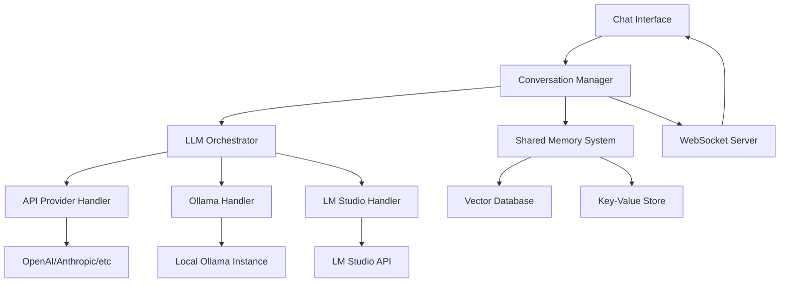
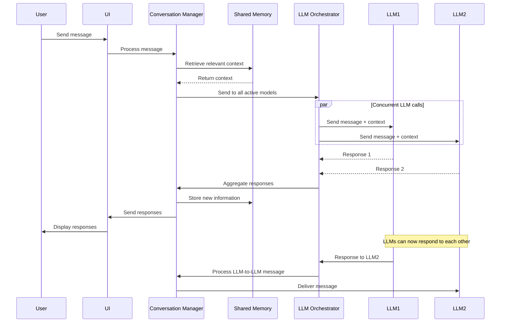

# Multi-LLM Chat Interface Design Document

## Overview

The Multi-LLM Chat Interface is a web-based application that enables real-time conversations between users and multiple Large Language Models simultaneously. The system supports various LLM providers (API-based, Ollama, LM Studio) and implements a shared memory system that allows models to communicate with each other and maintain persistent context across sessions.

## Architecture

### High-Level Architecture



### Technology Stack

- **Frontend**: React/TypeScript with WebSocket client for real-time updates
- **Backend**: Node.js/Express with WebSocket support
- **Shared Memory**: 
  - Vector Database (ChromaDB or Pinecone) for semantic memory
  - Redis for session state and fast key-value storage
- **LLM Integration**: Axios for HTTP clients, custom adapters for each provider
- **Real-time Communication**: Socket.io for WebSocket management

## Components and Interfaces

### 1. Chat Interface Component

**Purpose**: Main UI component for user interaction and conversation display

**Key Features**:
- Message input with model selection options
- Real-time message display with model attribution
- Model management panel (add/remove/pause models)
- Conversation history with threading support

**Interface**:
```typescript
interface ChatMessage {
  id: string;
  content: string;
  sender: 'user' | string; // 'user' or model identifier
  timestamp: Date;
  replyTo?: string; // For threading LLM-to-LLM conversations
  metadata?: {
    model: string;
    provider: string;
    processingTime?: number;
  };
}

interface ConversationState {
  id: string;
  participants: ModelParticipant[];
  messages: ChatMessage[];
  sharedMemory: SharedMemoryContext;
}
```

### 2. LLM Orchestrator

**Purpose**: Manages communication with multiple LLM providers and coordinates responses

**Key Features**:
- Provider abstraction layer
- Concurrent request handling
- Response aggregation and ordering
- Error handling and retry logic

**Interface**:
```typescript
interface LLMProvider {
  id: string;
  name: string;
  type: 'api' | 'ollama' | 'lmstudio';
  config: ProviderConfig;
  isActive: boolean;
}

interface ModelParticipant {
  id: string;
  provider: LLMProvider;
  modelName: string;
  displayName: string;
  color: string;
  avatar?: string;
  isActive: boolean;
}

interface LLMResponse {
  modelId: string;
  content: string;
  metadata: {
    processingTime: number;
    tokenCount?: number;
    error?: string;
  };
}
```

### 3. Shared Memory System

**Purpose**: Maintains persistent context and knowledge base accessible to all LLMs

**Key Features**:
- Semantic search for relevant context retrieval
- Automatic summarization of long conversations
- Knowledge extraction and storage
- Memory relevance scoring

**Interface**:
```typescript
interface SharedMemoryContext {
  conversationId: string;
  facts: MemoryFact[];
  summaries: ConversationSummary[];
  relationships: EntityRelationship[];
}

interface MemoryFact {
  id: string;
  content: string;
  source: string; // model or user who contributed
  timestamp: Date;
  relevanceScore: number;
  tags: string[];
}

interface ConversationSummary {
  id: string;
  timeRange: { start: Date; end: Date };
  summary: string;
  keyPoints: string[];
  participants: string[];
}
```

### 4. Provider Handlers

**Purpose**: Implement provider-specific communication protocols

#### API Provider Handler
- Supports OpenAI, Anthropic, Cohere, etc.
- Handles authentication and rate limiting
- Implements retry logic with exponential backoff

#### Ollama Handler
- Connects to local Ollama instance
- Manages model loading/unloading
- Handles streaming responses

#### LM Studio Handler
- Integrates with LM Studio's OpenAI-compatible API
- Discovers available models
- Manages connection health

## Data Models

### Conversation Flow



### Prompt Engineering for Multi-Agent Awareness

Each LLM receives a system prompt that includes:

```
You are participating in a multi-agent conversation with other AI models and a human user. 

Current participants: [Model1, Model2, Model3]
Your identifier: [YourModelName]
Shared memory context: [Relevant facts and summaries]

Guidelines:
- You can respond to the user or address other AI participants directly
- Use @ModelName to address specific models
- Acknowledge and build upon other models' contributions
- Contribute new information to the shared knowledge base
- Be collaborative and respectful in discussions
```

## Error Handling

### Provider Connection Failures
- Implement circuit breaker pattern for each provider
- Display clear error states in UI
- Provide retry mechanisms with exponential backoff
- Graceful degradation when models become unavailable

### Memory System Failures
- Fallback to conversation history when vector DB is unavailable
- Implement local caching for critical memory data
- Provide manual memory refresh options

### WebSocket Connection Issues
- Automatic reconnection with exponential backoff
- Message queuing during disconnection
- Connection status indicators in UI

## Testing Strategy

### Unit Testing
- Provider handler implementations
- Shared memory operations
- Message processing logic
- Prompt generation functions

### Integration Testing
- End-to-end conversation flows
- Multi-provider concurrent operations
- Memory persistence across sessions
- WebSocket communication reliability

### Performance Testing
- Concurrent LLM request handling
- Memory system scalability
- UI responsiveness with multiple active models
- Large conversation history management

### User Experience Testing
- Model addition/removal workflows
- Conversation threading and attribution
- Export/import functionality
- Error state handling and recovery

## Security Considerations

### API Key Management
- Secure storage of provider credentials
- Environment variable configuration
- Key rotation support
- Audit logging for API usage

### Data Privacy
- Local storage options for sensitive conversations
- Configurable data retention policies
- Memory data encryption at rest
- User consent for data persistence

### Rate Limiting and Abuse Prevention
- Per-provider rate limiting
- Cost monitoring for paid APIs
- Usage analytics and alerting
- Graceful handling of quota exceeded scenarios